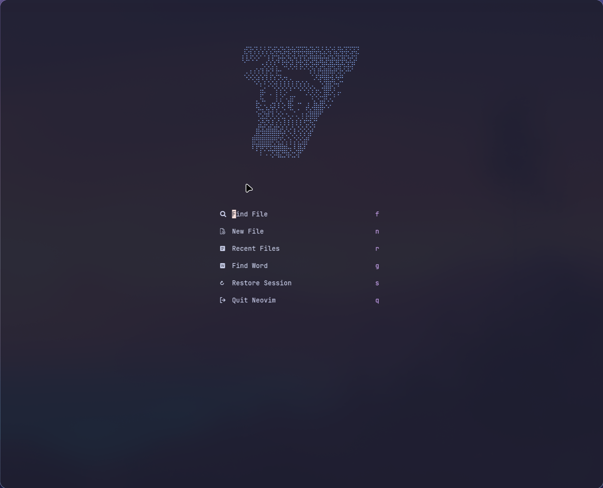
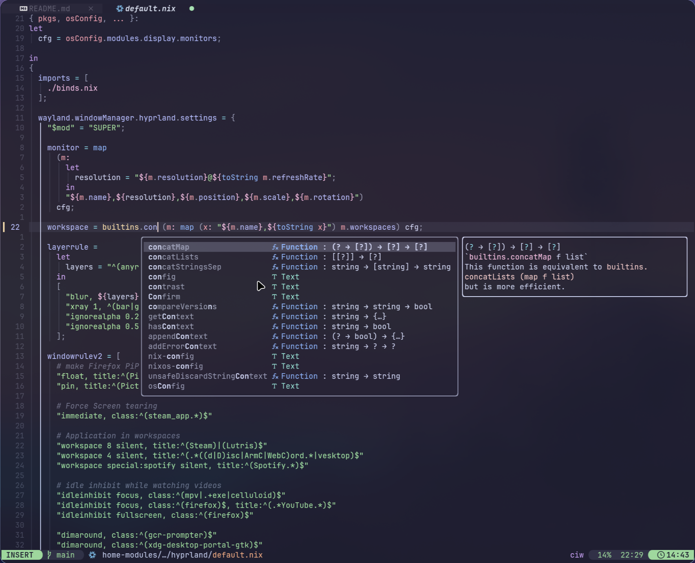
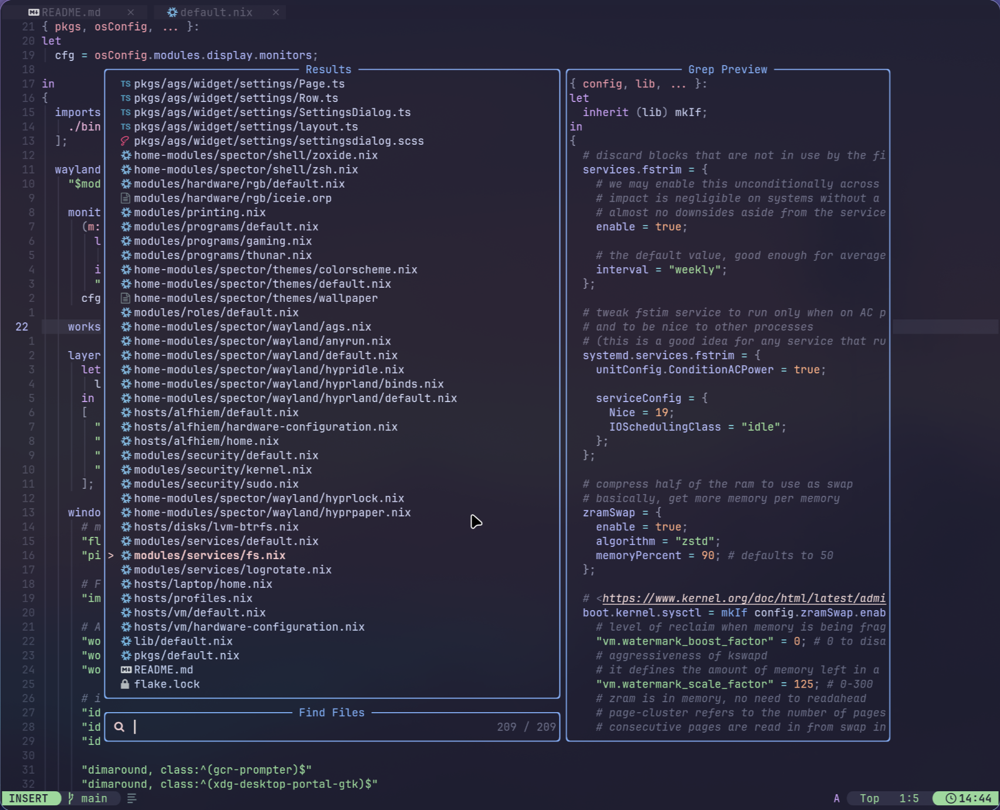

<h1 align="center">
      
      <br>

  Akari <br>
   <br>
  <div align="center">

  <div align="center">
   <p></p>
   <a href="">
      
   </a>
   <a href="https://github.com/sioodmy/dotfiles/">
      
   </a>
      <a = href="https://nixos.org">
      
    </a>
   <br>
</div>
</h1>

<br>
</div>




<p align="center"> Screenshots Circa: 2024-4-9</p>

---

# Akari

Standalone nixvim flake based on Lazyvim with some more changes.

## Installation

If you'd like to give it a try before installing: `nix run github:spector700/Akari`

<details>
    <summary><b>INSTALLATION GUIDE</b></summary>

```
1- Go to the flake.nix and add `Akari.url = "github:spector700/Akari"` to your inputs.

2- Run nix flake update

3- Install it by adding inputs.Akari.packages.${system}.default to your environment.systemPackages or home.packages if you're using home-manager.

4- Rebuild your system and you should be done.
```

</details>

## Configuring

To start configuring, just add or modify the nix files in `./config`.
If you add a new configuration file, remember to add it to the
[`config/default.nix`](./config/default.nix) file

## Testing your new configuration

To test your configuration simply run the following command

```
nix run .
```
